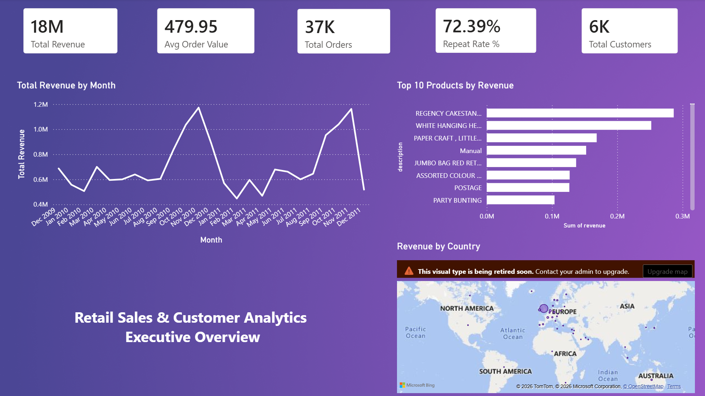
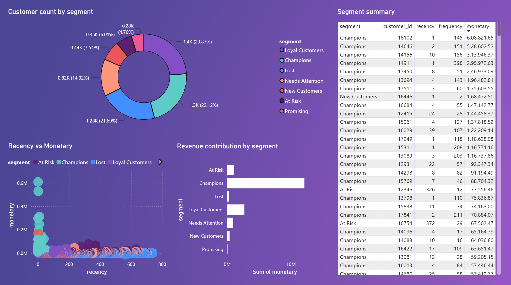

# Retail Sales & Customer Analytics Pipeline

An end-to-end retail analytics project covering data cleaning, customer segmentation, SQL analysis, and business intelligence dashboarding using the UCI Online Retail II dataset.

The project analyzes approximately 1 million UK retail transactions from December 2009 to December 2011 to identify sales trends, customer behavior, and actionable business insights.

**Tools used:** SQL (MySQL) · Python (Pandas) · Power BI · Jupyter Notebook

---

## Project Overview

This project simulates a real-world retail analytics workflow:

1. **SQL** — Load, clean, validate, and analyze approximately 1 million raw transaction records using MySQL.
2. **Python** — Perform RFM (Recency, Frequency, Monetary) analysis and segment customers based on purchasing behavior.
3. **Power BI** — Build an interactive dashboard for sales performance and customer segmentation.

---

## Repository Structure

```text
retail-sales-customer-analytics/
│
├── DashBoard [Retail Analytics].pbix
├── README.md
├── clean_transactions.csv
├── customer_segmentation.png
├── executive_overview.png
├── online_retail_ii.csv
├── retail_rfm_analysis.ipynb
├── retail_sql_analysis.sql
└── rfm_segments.csv
```

---

## Key Insights

### Sales Performance

- Analyzed **£17.7M** in revenue across **805,531** cleaned transactions.
- Revenue showed strong seasonality, with peaks during **October and November** in both 2010 and 2011.
- Approximately **97% of revenue came from the UK**, with about **£14.7M** generated from the UK market.
- Product analysis showed differences between high-revenue products and high-volume products.

### Customer Behavior

- **72.4% repeat purchase rate** across **5,878 customers**.
- One customer placed only 2 orders but generated approximately **£168K** in revenue, representing a significant high-value customer outlier.
- Customer purchasing behavior was analyzed using Recency, Frequency, and Monetary metrics.

### RFM Segmentation

Customers were divided into seven segments:

- Champions
- Loyal Customers
- New Customers
- Promising
- Needs Attention
- At Risk
- Lost

Key findings:

- **22% of customers classified as Champions generated 68% of total revenue.**
- **1,628 customers** were classified as At Risk or Lost, representing approximately **£1.45M** in historical revenue.

---

## Dashboard Preview

### Executive Overview

Sales KPIs, monthly revenue trends, top products, and revenue by country.



### Customer Segmentation

RFM-based customer segments, revenue contribution by segment, and customer recency and monetary analysis.



---

## How to Reproduce

### 1. Download the Dataset

The project uses the [UCI Online Retail II dataset](https://archive.ics.uci.edu/dataset/502/online+retail+ii).

The dataset is also included in this repository as:

```text
online_retail_ii.csv
```

### 2. Run SQL Analysis

Open MySQL and run:

```text
retail_sql_analysis.sql
```

This script loads, cleans, validates, and analyzes the transaction data.

### 3. Run RFM Analysis

Open:

```text
retail_rfm_analysis.ipynb
```

The notebook uses Python and Pandas to calculate RFM scores and customer segments.

### 4. Open the Power BI Dashboard

Open:

```text
DashBoard [Retail Analytics].pbix
```

in Power BI Desktop and refresh the data sources if required.

---

## Skills Demonstrated

- Data Gathering
- Data Cleaning
- Data Validation
- Data Transformation
- SQL Analysis
- ETL
- Customer Segmentation
- RFM Analysis
- Data Visualization
- Power BI Dashboard Development
- Python and Pandas
- Relational Database Management

---

## Author

**Immadi Sathwik**
